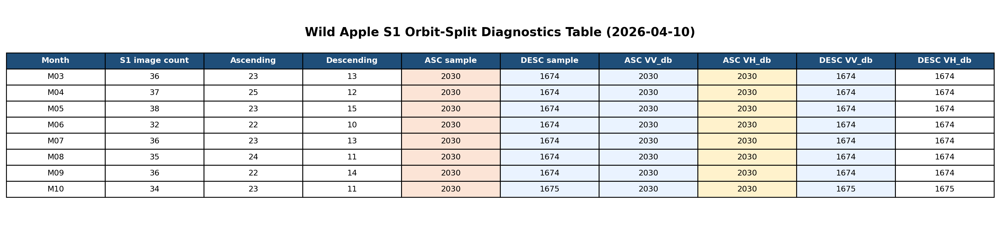
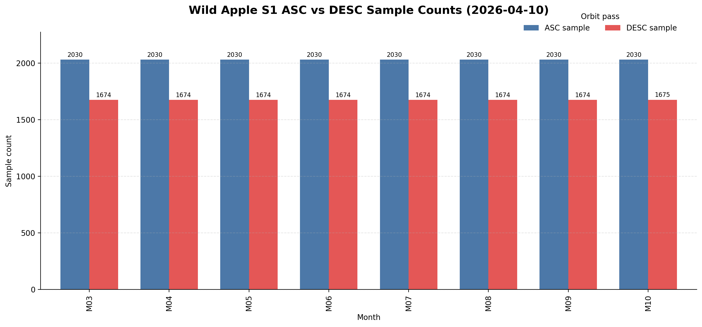

# 野苹果林遥感当日工作记录_2026-04-10

时间戳：`2026-04-10 23:25:53 +08:00`

本文档用于汇总 2026 年 4 月 10 日围绕 Sentinel-1 调试、特征定义修正、轨道拆分、降噪策略和特征筛选策略所做的改造、实验、关键 cell 输出与阶段性结论。

相关文件：

- [wildapple_sampling_monthly_diagnostics_debug.ipynb](d:/CODE/VS__Project/GEE/WildAppleForest_GEE/wildapple_sampling_monthly_diagnostics_debug.ipynb)
- [野苹果林遥感采样调试记录.md](d:/CODE/VS__Project/GEE/WildAppleForest_GEE/野苹果林遥感采样调试记录.md)
- [野苹果林遥感特征筛选策略.md](d:/CODE/VS__Project/GEE/WildAppleForest_GEE/野苹果林遥感特征筛选策略.md)
- [render_s1_debug_figures.py](d:/CODE/VS__Project/GEE/WildAppleForest_GEE/scripts/render_s1_debug_figures.py)

---

## 一、今日改造内容

### 1. 继续使用 debug notebook 作为唯一实验入口

今天没有回到主 notebook 做正式实现，所有工作都继续在：

- [wildapple_sampling_monthly_diagnostics_debug.ipynb](d:/CODE/VS__Project/GEE/WildAppleForest_GEE/wildapple_sampling_monthly_diagnostics_debug.ipynb)

这样做的目的有两个：

- 避免把尚未验证完成的 Sentinel-1 改动直接污染主流程
- 保持实验路径清晰，便于逐项验证问题来源

### 2. 完成 Sentinel-1 主因定位后的最小修复验证

昨天的调试已经证明，样本塌缩的主因来自：

- `VV_db`
- `VH_db`

此前这两个波段在代码中对 `COPERNICUS/S1_GRD` 的 `VV` / `VH` 又做了一次 `log10()`，导致大量负值像元变成 masked。

今天先延续这一结论，在 debug notebook 中保留“最小修复验证”的结果，并将其记录到：

- [野苹果林遥感采样调试记录.md](d:/CODE/VS__Project/GEE/WildAppleForest_GEE/野苹果林遥感采样调试记录.md)

### 3. 对 Sentinel-1 做进一步结构性改造

今天在 debug notebook 中新增了三类更正式的 Sentinel-1 处理逻辑：

#### 3.1 dB-aware 的 SAR 特征定义

不再把 `VV` / `VH` 直接当作待 `log10()` 的线性值处理，而是改为：

- 视 `COPERNICUS/S1_GRD` 的 `VV` / `VH` 为原始 dB 域后向散射
- 先将其转换到线性域
- 在线性域进行 speckle 降噪
- 再转回 dB，得到：
  - `VV_db`
  - `VH_db`

同时新增和修正规范化的 SAR 特征：

- `VV_VH_ratio`
  - 在线性域计算
- `VV_minus_VH_db`
  - 在 dB 域用差值表达极化差异

#### 3.2 ASC / DESC 分轨保留

不再把升轨和降轨影像混在同一个月里合成，而是分别保留：

- `ASCENDING` 轨道
- `DESCENDING` 轨道

并生成分别带轨道标识的月特征，例如：

- `VV_db_ASC_M03`
- `VH_db_ASC_M03`
- `VV_VH_ratio_ASC_M03`
- `VV_minus_VH_db_ASC_M03`
- `VV_db_DESC_M03`
- `VH_db_DESC_M03`
- `VV_VH_ratio_DESC_M03`
- `VV_minus_VH_db_DESC_M03`

这样处理的目标是：

- 避免山区观测几何差异被混入月序列
- 后续让筛选和模型决定保留哪类轨道信息

#### 3.3 加入显式 speckle filter

今天在 debug notebook 中加入了线性域 boxcar speckle filter：

- 使用 `reduceNeighborhood(mean)`
- 使用 `ee.Kernel.square(radius=CONFIG["s1_speckle_radius_pixels"])`

当前参数：

- `s1_speckle_radius_pixels = 1`

这意味着当前 Sentinel-1 不再只依赖：

- 月内 `median`
- 以及之前的重采样

而是显式先做了一步 speckle 平滑。

### 4. 新增一份独立的特征筛选策略文档

今天还新增了一份独立文档：

- [野苹果林遥感特征筛选策略.md](d:/CODE/VS__Project/GEE/WildAppleForest_GEE/野苹果林遥感特征筛选策略.md)

文档中整理了：

- 为什么先把 `ASC/DESC` 分开保留
- 三层特征筛选流程
- `J-M` 在关键类别对上的用法
- RF + 相关性去冗余的建议
- 推荐优先保留的光学、SAR 和生境特征

---

## 二、今日实验与分析过程

### 1. 继续追问 `VV_db` / `VH_db` / `VV_VH_ratio`

今天先确认了一个关键思路：

- 这一步的目标不是一次性把所有 SAR 特征都定义到最终状态
- 而是优先验证导致样本塌缩的主因

因此在讨论中明确区分了两件事：

- “先定位主因”
- “再规范全部特征定义”

当时的判断是：

- `VV_db` / `VH_db` 二次 `log10()` 是更高优先级问题
- `VV_VH_ratio` 在 dB 域直接相除也不严谨，但不是当前样本塌缩主因

### 2. 对“为什么不直接删掉一个轨道方向”进行了方法论讨论

今天也明确了为什么当前不直接只保留 `ASC` 或只保留 `DESC`：

- 还没有证据表明哪个轨道方向绝对更优
- 山区坡向与观测几何关系复杂
- 同一地物在升轨和降轨下可能都有效，但响应不同

因此当前策略是：

- 先分轨保留
- 后续通过特征筛选决定取舍

### 3. 对 speckle 处理是否足够进行了技术判断

此前 SAR 主要靠：

- 月内 `median`
- 重采样

这种处理偏弱，所以今天在 debug notebook 中加入了显式 boxcar 降噪，作为当前调试阶段的稳妥基线。

今天的结论不是“这已经是最终最优降噪”，而是：

- 这比原先的 `median + bilinear` 更完整
- 作为 debug 基线是合理的
- 后续仍可以对 `radius=0/1/2` 做比较

---

## 三、今日关键 cell 输出

### 1. 分轨与新 SAR 定义后的输出

```text
Wild apple sample count: 150
Rectangle sample count: 65
WorldCover sample count: 750
Sampling region count: 965
--- S1 M03 diagnostics ---
S1_M03 image count: 36
S1_M03 ascending count: 23
S1_M03 descending count: 13
S1_ASC_M03 sample count: 2030
S1_ASC_M03_VV_db sample count: 2030
S1_ASC_M03_VH_db sample count: 2030
S1_ASC_M03_VV_VH_ratio sample count: 2030
S1_ASC_M03_VV_minus_VH_db sample count: 2030
S1_DESC_M03 sample count: 1674
S1_DESC_M03_VV_db sample count: 1674
S1_DESC_M03_VH_db sample count: 1674
S1_DESC_M03_VV_VH_ratio sample count: 1674
S1_DESC_M03_VV_minus_VH_db sample count: 1674
--- S1 M04 diagnostics ---
S1_M04 image count: 37
S1_M04 ascending count: 25
S1_M04 descending count: 12
S1_ASC_M04 sample count: 2030
S1_ASC_M04_VV_db sample count: 2030
S1_ASC_M04_VH_db sample count: 2030
S1_ASC_M04_VV_VH_ratio sample count: 2030
S1_ASC_M04_VV_minus_VH_db sample count: 2030
S1_DESC_M04 sample count: 1674
S1_DESC_M04_VV_db sample count: 1674
S1_DESC_M04_VH_db sample count: 1674
S1_DESC_M04_VV_VH_ratio sample count: 1674
S1_DESC_M04_VV_minus_VH_db sample count: 1674
--- S1 M05 diagnostics ---
S1_M05 image count: 38
S1_M05 ascending count: 23
S1_M05 descending count: 15
S1_ASC_M05 sample count: 2030
S1_ASC_M05_VV_db sample count: 2030
S1_ASC_M05_VH_db sample count: 2030
S1_ASC_M05_VV_VH_ratio sample count: 2030
S1_ASC_M05_VV_minus_VH_db sample count: 2030
S1_DESC_M05 sample count: 1674
S1_DESC_M05_VV_db sample count: 1674
S1_DESC_M05_VH_db sample count: 1674
S1_DESC_M05_VV_VH_ratio sample count: 1674
S1_DESC_M05_VV_minus_VH_db sample count: 1674
--- S1 M06 diagnostics ---
S1_M06 image count: 32
S1_M06 ascending count: 22
S1_M06 descending count: 10
S1_ASC_M06 sample count: 2030
S1_ASC_M06_VV_db sample count: 2030
S1_ASC_M06_VH_db sample count: 2030
S1_ASC_M06_VV_VH_ratio sample count: 2030
S1_ASC_M06_VV_minus_VH_db sample count: 2030
S1_DESC_M06 sample count: 1674
S1_DESC_M06_VV_db sample count: 1674
S1_DESC_M06_VH_db sample count: 1674
S1_DESC_M06_VV_VH_ratio sample count: 1674
S1_DESC_M06_VV_minus_VH_db sample count: 1674
--- S1 M07 diagnostics ---
S1_M07 image count: 36
S1_M07 ascending count: 23
S1_M07 descending count: 13
S1_ASC_M07 sample count: 2030
S1_ASC_M07_VV_db sample count: 2030
S1_ASC_M07_VH_db sample count: 2030
S1_ASC_M07_VV_VH_ratio sample count: 2030
S1_ASC_M07_VV_minus_VH_db sample count: 2030
S1_DESC_M07 sample count: 1674
S1_DESC_M07_VV_db sample count: 1674
S1_DESC_M07_VH_db sample count: 1674
S1_DESC_M07_VV_VH_ratio sample count: 1674
S1_DESC_M07_VV_minus_VH_db sample count: 1674
--- S1 M08 diagnostics ---
S1_M08 image count: 35
S1_M08 ascending count: 24
S1_M08 descending count: 11
S1_ASC_M08 sample count: 2030
S1_ASC_M08_VV_db sample count: 2030
S1_ASC_M08_VH_db sample count: 2030
S1_ASC_M08_VV_VH_ratio sample count: 2030
S1_ASC_M08_VV_minus_VH_db sample count: 2030
S1_DESC_M08 sample count: 1674
S1_DESC_M08_VV_db sample count: 1674
S1_DESC_M08_VH_db sample count: 1674
S1_DESC_M08_VV_VH_ratio sample count: 1674
S1_DESC_M08_VV_minus_VH_db sample count: 1674
--- S1 M09 diagnostics ---
S1_M09 image count: 36
S1_M09 ascending count: 22
S1_M09 descending count: 14
S1_ASC_M09 sample count: 2030
S1_ASC_M09_VV_db sample count: 2030
S1_ASC_M09_VH_db sample count: 2030
S1_ASC_M09_VV_VH_ratio sample count: 2030
S1_ASC_M09_VV_minus_VH_db sample count: 2030
S1_DESC_M09 sample count: 1674
S1_DESC_M09_VV_db sample count: 1674
S1_DESC_M09_VH_db sample count: 1674
S1_DESC_M09_VV_VH_ratio sample count: 1674
S1_DESC_M09_VV_minus_VH_db sample count: 1674
--- S1 M10 diagnostics ---
S1_M10 image count: 34
S1_M10 ascending count: 23
S1_M10 descending count: 11
S1_ASC_M10 sample count: 2030
S1_ASC_M10_VV_db sample count: 2030
S1_ASC_M10_VH_db sample count: 2030
S1_ASC_M10_VV_VH_ratio sample count: 2030
S1_ASC_M10_VV_minus_VH_db sample count: 2030
S1_DESC_M10 sample count: 1675
S1_DESC_M10_VV_db sample count: 1675
S1_DESC_M10_VH_db sample count: 1675
S1_DESC_M10_VV_VH_ratio sample count: 1675
S1_DESC_M10_VV_minus_VH_db sample count: 1675
MONTHLY_IMAGE sample count: 1666
SUMMARY_IMAGE sample count: 1666
TEXTURE_IMAGE sample count: 2030
TERRAIN_IMAGE sample count: 1643
Sample feature count: 1665
```

### 2. 关键结果文本表格

按月整理后的核心输出如下：

| 月份 | S1影像数 | 升轨数 | 降轨数 | ASC sample | DESC sample | MONTHLY_IMAGE | SUMMARY_IMAGE |
| --- | ---: | ---: | ---: | ---: | ---: | ---: | ---: |
| M03 | 36 | 23 | 13 | 2030 | 1674 | 1666 | 1666 |
| M04 | 37 | 25 | 12 | 2030 | 1674 | 1666 | 1666 |
| M05 | 38 | 23 | 15 | 2030 | 1674 | 1666 | 1666 |
| M06 | 32 | 22 | 10 | 2030 | 1674 | 1666 | 1666 |
| M07 | 36 | 23 | 13 | 2030 | 1674 | 1666 | 1666 |
| M08 | 35 | 24 | 11 | 2030 | 1674 | 1666 | 1666 |
| M09 | 36 | 22 | 14 | 2030 | 1674 | 1666 | 1666 |
| M10 | 34 | 23 | 11 | 2030 | 1675 | 1666 | 1666 |

补充的整体指标：

| 指标 | 数值 |
| --- | ---: |
| Wild apple sample count | 150 |
| Rectangle sample count | 65 |
| WorldCover sample count | 750 |
| Sampling region count | 965 |
| TEXTURE_IMAGE sample count | 2030 |
| TERRAIN_IMAGE sample count | 1643 |
| Sample feature count | 1665 |

### 3. 图形化结果





---

## 四、今日结论分析

### 1. `VV_db` / `VH_db` / `VV_VH_ratio` 的处理方向是对的

今天最重要的一个结论是：

- 新的 `VV_db` / `VH_db` 构造方式没有再引入样本塌缩
- 在线性域计算 `VV_VH_ratio` 也是稳定的
- 新增的 `VV_minus_VH_db` 也没有引入新的 mask 问题

这说明当前 debug 版本下的 Sentinel-1 特征定义已经从“错误写法导致样本崩溃”，进入到了“可以继续做轨道和筛选实验”的阶段。

### 2. 升轨和降轨确实存在系统性差异

今天最值得重视的现象是：

- `ASC` 每个月都稳定在 `2030`
- `DESC` 每个月都稳定在 `1674` 或 `1675`

并且：

- `DESC` 的 `VV_db`
- `DESC` 的 `VH_db`
- `DESC` 的 `VV_VH_ratio`
- `DESC` 的 `VV_minus_VH_db`

全部都是同样的 sample count。

这说明：

- 不是某个 `DESC` 派生波段单独出问题
- 而是 `DESC` 这条轨道链本身在样本区中就有稳定的有效覆盖缺口
- 这个问题更像观测几何 / 轨道覆盖差异，而不是随机噪声或单个 band 定义错误

这也进一步证明：

- 在山区里，不适合把 `ASC` 和 `DESC` 简单混在同一个月序列里

### 3. 当前 `MONTHLY_IMAGE` 和 `SUMMARY_IMAGE` 的瓶颈，已经从“错误波段定义”转成了“轨道链覆盖交集”

当前输出显示：

- `MONTHLY_IMAGE sample count: 1666`
- `SUMMARY_IMAGE sample count: 1666`
- `Sample feature count: 1665`

这说明现在的限制不再是 `VV_db` / `VH_db` 的错误定义，而是：

- 分轨保留后
- 多个月份的 `DESC` 链只在较小的稳定交集中完整存在
- 最终多月联合特征栈被这部分交集所限制

换句话说：

- 之前的问题是“定义错误”
- 现在的问题已经升级为“要不要为保留 `DESC` 信息而接受更少样本”

这是一个更合理、更高级别的问题。

### 4. speckle 处理至少已经满足当前 debug 目标

今天加入的线性域 boxcar filter 有两个直接效果：

- 没有造成新的掩膜塌缩
- 让当前 Sentinel-1 月特征链保持稳定可采样

所以今天对 speckle 的阶段性结论是：

- 原来的 `median + 重采样` 确实偏弱
- 当前 `线性域 boxcar + 月合成` 作为 debug 基线是合理的
- 但它还不是最终一定最优的降噪方案

后续仍可继续比较：

- `radius = 0`
- `radius = 1`
- `radius = 2`

### 5. 为什么今天没有立即回主 notebook

今天没有回到主 notebook 的原因是：

- 现在虽然已经修正了 SAR 特征定义
- 但“`ASC-only` 还是 `ASC+DESC separated`”这个决策还没做完
- speckle 参数也还没有对比完

因此当前更合理的策略仍然是：

- 继续只在 debug notebook 中做 Sentinel-1 机制实验
- 把机制和参数定下来后，再迁回主 notebook

---

## 五、今日形成或更新的文档与资产

### 1. 新增文档

- [野苹果林遥感特征筛选策略.md](d:/CODE/VS__Project/GEE/WildAppleForest_GEE/野苹果林遥感特征筛选策略.md)

### 2. 延续使用的调试记录

- [野苹果林遥感采样调试记录.md](d:/CODE/VS__Project/GEE/WildAppleForest_GEE/野苹果林遥感采样调试记录.md)

### 3. 已存在的图形生成脚本

- [render_s1_debug_figures.py](d:/CODE/VS__Project/GEE/WildAppleForest_GEE/scripts/render_s1_debug_figures.py)

---

## 六、建议的下一步

如果下一轮继续留在 debug notebook，建议按这个顺序推进：

1. 做 `ASC-only` 与 `ASC+DESC-separated` 的直接对比
   - 看样本损失是否值得
   - 看是否真的需要保留 `DESC`

2. 对 speckle filter 做半径对比
   - `radius = 0`
   - `radius = 1`
   - `radius = 2`

3. 在确认轨道策略和 speckle 参数后，再决定是否迁回主 notebook

当前阶段最核心的未决策问题已经不是：

- `VV_db` 怎么定义
- `VH_db` 怎么定义

而是：

- `DESC` 这条链是否值得保留进最终候选特征集
- speckle 降噪强度到底选多大更合适
