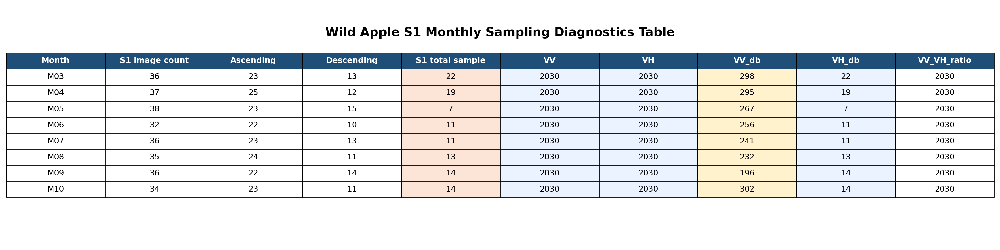
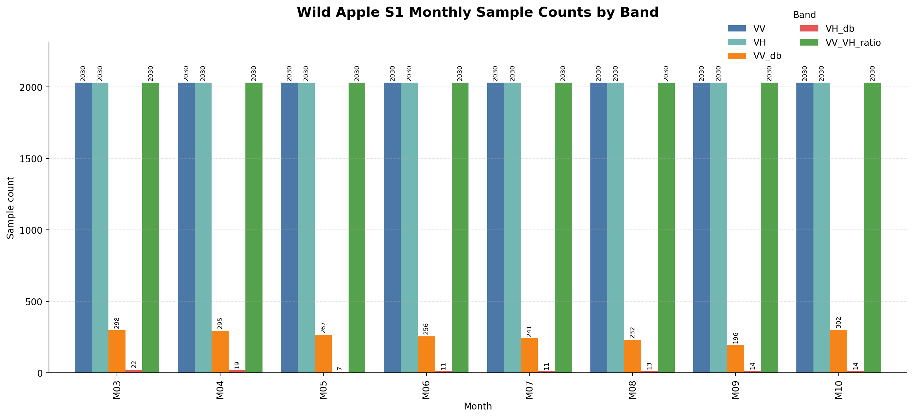
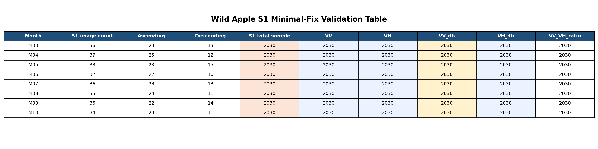
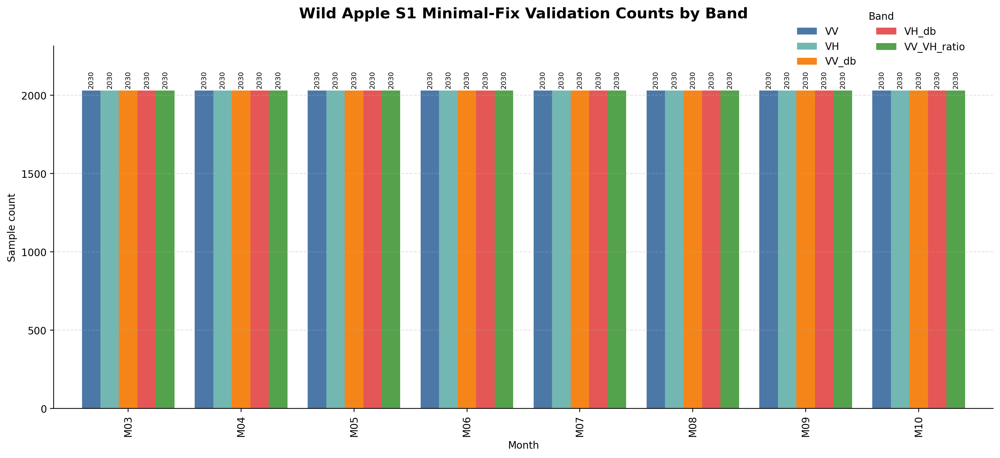

# 野苹果林遥感采样调试记录

用于记录 `wildapple_localrun_python.ipynb` 与 `wildapple_sampling_monthly_diagnostics_debug.ipynb` 在本地 GEE Python 环境中的关键调试问题、判断依据与当前结论。

---

## 一、已定位问题

### 1. Earth Engine 初始化顺序错误
- 现象：
  - 在 notebook 前部执行 `PROJ = ee.Projection(...).atScale(...)` 时直接报 `Earth Engine client library not initialized`
- 原因：
  - `ee.Initialize(...)` 之前不能构造依赖 EE API 状态的对象
- 处理：
  - 改为先 `PROJ = None`
  - 在 `ee.Initialize(project=...)` 之后再创建 `PROJ`

### 2. VS Code 中交互式地图不显示
- 现象：
  - `LeafletMapModel` / `jupyter-leaflet` 相关报错
  - 后续又出现 `BoxKeyError: 'xyz_to_folium'`
- 原因：
  - 当前 VS Code + 本地环境下，`ipyleaflet` 渲染链不稳定
  - `geemap.foliumap` 在当前环境的底图库封装也不兼容
- 处理：
  - 不再依赖 `geemap.Map()` 或 `geemap.foliumap.Map()`
  - ROI 地图改为纯 `folium`：
    - Google 卫星瓦片
    - EE 几何转 GeoJSON
    - `folium.GeoJson` 叠加 ROI 边界
- 当前状态：
  - ROI 地图已正常显示

### 3. Wild Apple 样本数为 0
- 现象：
  - `Wild apple sample count: 0`
- 原因判断：
  - `wildapple_sample` 资产不能直接信任自带 geometry
  - 原始 JS 脚本就是通过 `Longitude/Latitude` 强制重建点
- 处理：
  - `load_wildapple_samples()` 改为无条件使用 `Longitude/Latitude` 重建点 geometry
- 当前状态：
  - `Wild apple sample count: 150`
  - 该问题已解决

### 4. `Collection.toList: count must be positive`
- 现象：
  - 样本为空时，`add_string_id()` 内部 `toList(0)` 报错
- 原因：
  - 旧实现没有对空集合做保护
- 处理：
  - `add_string_id()` 增加空集合安全分支
- 当前状态：
  - 该问题已解决

### 5. `Image.select: Invalid band number (-1)`
- 现象：
  - 在构建 `SUMMARY_IMAGE` 时，`stack.select([-1])` 报错
- 原因：
  - Earth Engine Python 不支持用 `-1` 选最后一个 band
- 处理：
  - 改为 `stack.select([len(MONTHS) - 1])`
- 当前状态：
  - 该问题已解决

---

## 二、当前核心问题

### 1. 采样区域正常，但最终样本几乎被清空
当前诊断输出：

```text
Wild apple sample count: 150
Rectangle sample count: 65
WorldCover sample count: 750
Sampling region count: 965
MONTHLY_IMAGE sample count: 2
SUMMARY_IMAGE sample count: 2
TEXTURE_IMAGE sample count: 2030
TERRAIN_IMAGE sample count: 1643
Sample feature count: 2
```

这说明：
- 样本区域集合构建正常
- 地形和纹理层不构成主要瓶颈
- 真正导致样本塌缩的是 `MONTHLY_IMAGE`
- `SUMMARY_IMAGE` 继承了 `MONTHLY_IMAGE` 的 mask 问题

### 2. 逐月诊断已经指向 Sentinel-1
已有逐月采样输出：

```text
S2_M03 sample count: 2030
S1_M03 sample count: 22
S2_M04 sample count: 2030
S1_M04 sample count: 19
S2_M05 sample count: 2030
S1_M05 sample count: 7
S2_M06 sample count: 2023
S1_M06 sample count: 11
S2_M07 sample count: 2030
S1_M07 sample count: 11
S2_M08 sample count: 2030
S1_M08 sample count: 13
S2_M09 sample count: 2030
S1_M09 sample count: 14
S2_M10 sample count: 2030
S1_M10 sample count: 14
```

这说明：
- `S2` 月尺度样本有效值整体正常
- `S1` 月尺度样本有效值极低
- 一旦把 `S1` 拼入多月联合特征栈，`sampleRegions()` 基本把绝大多数样本剔除

---

## 三、当前判断

### 1. 已确认结论
- `Wild apple sample` 的问题已经解决。
  - 资产读取后必须无条件使用 `Longitude/Latitude` 重建点 geometry。
  - 当前 `Wild apple sample count: 150` 说明这条链路已恢复正常。
- `Sample feature count: 2` 的主因不是样本数量不足，而是 `MONTHLY_IMAGE` 中的 `S1` 月尺度特征几乎把样本全部筛空。
- `SUMMARY_IMAGE sample count: 2` 与 `MONTHLY_IMAGE sample count: 2` 一致，说明问题会从月尺度原始序列继续传递到统计特征层。
- `TEXTURE_IMAGE sample count: 2030` 与 `TERRAIN_IMAGE sample count: 1643` 明显高于 `MONTHLY_IMAGE`，说明：
  - 纹理层不是当前主瓶颈
  - 地形层不是当前主瓶颈
  - 当前无需优先怀疑 ROI、采样区域构造或 `sampleRegions()` 机制本身

### 2. 已定位到的波段级现象
- 光学月序列基本正常：
  - `S2_M03` 到 `S2_M10` 的 sample count 都在 `2023-2030` 左右
  - 说明 `S2` 的月尺度合成在样本区上总体有稳定有效值
- `S1` 月序列明显异常：
  - `S1_M03 sample count: 22`
  - `S1_M04 sample count: 19`
  - `S1_M05 sample count: 7`
  - `S1_M06 sample count: 11`
  - `S1_M07 sample count: 11`
  - `S1_M08 sample count: 13`
  - `S1_M09 sample count: 14`
  - `S1_M10 sample count: 14`
- 这说明当前 `S1` 月合成影像里，至少下面这些 band 组合之一在样本区上大面积为 masked：
  - `VV`
  - `VH`
  - `VV_db`
  - `VH_db`
  - `VV_VH_ratio`
- 由于 `MONTHLY_IMAGE` 是 8 个月的 `S2 + S1` 大特征栈，`sampleRegions()` 在任一 band 无值时都可能剔除该样本，因此：
  - 即使 `S2` 完整
  - 只要某个月的 `S1` 任一关键 band 缺值
  - 该样本就无法在 `MONTHLY_IMAGE` 中保留

### 3. 基于最新 cell 输出的直接证据

本轮 `S1` 细化诊断输出可以整理成下表：

| 月份 | S1影像数 | 升轨 | 降轨 | S1总sample | VV | VH | VV_db | VH_db | VV_VH_ratio |
| --- | ---: | ---: | ---: | ---: | ---: | ---: | ---: | ---: | ---: |
| M03 | 36 | 23 | 13 | 22 | 2030 | 2030 | 298 | 22 | 2030 |
| M04 | 37 | 25 | 12 | 19 | 2030 | 2030 | 295 | 19 | 2030 |
| M05 | 38 | 23 | 15 | 7 | 2030 | 2030 | 267 | 7 | 2030 |
| M06 | 32 | 22 | 10 | 11 | 2030 | 2030 | 256 | 11 | 2030 |
| M07 | 36 | 23 | 13 | 11 | 2030 | 2030 | 241 | 11 | 2030 |
| M08 | 35 | 24 | 11 | 13 | 2030 | 2030 | 232 | 13 | 2030 |
| M09 | 36 | 22 | 14 | 14 | 2030 | 2030 | 196 | 14 | 2030 |
| M10 | 34 | 23 | 11 | 14 | 2030 | 2030 | 302 | 14 | 2030 |



这张表直接说明：
- 月内 `S1` 影像数并不少，`32-38` 景足够支撑月合成。
- 升轨和降轨在每个月都同时存在，不是“某个月完全没有可用轨道”的问题。
- `VV`、`VH`、`VV_VH_ratio` 的 sample count 每个月都稳定在 `2030`，说明原始 `S1` 覆盖和基本采样能力是正常的。
- `VV_db` 明显缩减到 `196-302`。
- `VH_db` 进一步缩减到 `7-22`。
- `S1_Mxx sample count` 与 `VH_db` 的 sample count 几乎完全一致，说明当前每个月的 `S1` 总体塌缩是被 `VH_db` 这个 band 卡住的。

同一组结果可以用直方图概括如下：

```text
S1 monthly sample-count pattern

M03  VV           2030 | ####################
     VH           2030 | ####################
     VV_VH_ratio  2030 | ####################
     VV_db         298 | ###
     VH_db          22 | 

M04  VV           2030 | ####################
     VH           2030 | ####################
     VV_VH_ratio  2030 | ####################
     VV_db         295 | ###
     VH_db          19 | 

M05  VV           2030 | ####################
     VH           2030 | ####################
     VV_VH_ratio  2030 | ####################
     VV_db         267 | ###
     VH_db           7 | 

M06  VV           2030 | ####################
     VH           2030 | ####################
     VV_VH_ratio  2030 | ####################
     VV_db         256 | ###
     VH_db          11 | 

M07  VV           2030 | ####################
     VH           2030 | ####################
     VV_VH_ratio  2030 | ####################
     VV_db         241 | ##
     VH_db          11 | 

M08  VV           2030 | ####################
     VH           2030 | ####################
     VV_VH_ratio  2030 | ####################
     VV_db         232 | ##
     VH_db          13 | 

M09  VV           2030 | ####################
     VH           2030 | ####################
     VV_VH_ratio  2030 | ####################
     VV_db         196 | ##
     VH_db          14 | 

M10  VV           2030 | ####################
     VH           2030 | ####################
     VV_VH_ratio  2030 | ####################
     VV_db         302 | ###
     VH_db          14 | 
```



这张直方图表达的结论更直接：
- 真正异常的不是 `VV` / `VH` 原始波段。
- 真正异常的是 `VV_db`，尤其是 `VH_db`。
- 现在 `MONTHLY_IMAGE` 和 `SUMMARY_IMAGE` 的塌缩，本质上是被 `VH_db` 这条链拖垮的。

### 4. 对 `S1` 问题的高概率解释
- 第一类可能：`S1` 月时间窗太细。
  - 当前按自然月切分，导致某些月份样本区可用景数或可用像元过少。
  - 这会直接让该月的 `VV` / `VH` 近乎空影像。
- 第二类可能：样本区与 `S1` 实际有效覆盖范围错位。
  - 并不是 ROI 内完全没有 `S1`
  - 而是当前样本分布区在单月合成后只有很少位置有有效 `VV` / `VH`
- 第三类可能：`S1` 派生 band 放大了 mask 传播，而且当前实现里很可能存在波段域使用错误。
  - 尤其要重点怀疑：
    - `VV_VH_ratio`
    - `VV_db`
    - `VH_db`
  - 当前 debug notebook 里的 `preprocess_s1()` 是：
    - 直接读取 `COPERNICUS/S1_GRD` 的 `VV` / `VH`
    - 再执行 `vv.log10()` 和 `vh.log10()`
    - 再构造 `VV_db` / `VH_db`
  - 需要重点核实的一点是：
    - GEE 中 `COPERNICUS/S1_GRD` 的 `VV` / `VH` 是否已经是 dB 域
    - 如果本来就是 dB 值，那么再做一次 `log10()` 会把大量负值像元直接变成 masked
    - 这会优先拖垮 `VV_db` 和 `VH_db` 两个 band
  - `VV_VH_ratio` 也需要单独确认：
    - 如果当前是直接在 dB 域上做相除，这个比值本身就不稳定
    - 即使不全部变成 masked，也可能显著放大异常值和无效样本
- 第四类可能：当前 `S1` 集合过滤条件过严或样本区对应的轨道组合不足。
  - 例如某些月份虽然 ROI 内有 `S1`
  - 但样本所在区域只被少量轨道覆盖
  - 导致最终月合成在样本区内有效像元极少

### 5. 当前最可能的技术性根因
- 从本轮诊断结果看，前面列出的“时间窗过细”“覆盖不足”“轨道不足”已经不是主因。
- 当前最可疑的根因是 `preprocess_s1()` 中这两行：
  - `vv_db = ee.Image.constant(10).multiply(vv.log10()).rename("VV_db")`
  - `vh_db = ee.Image.constant(10).multiply(vh.log10()).rename("VH_db")`
- 如果 `COPERNICUS/S1_GRD` 的 `VV` / `VH` 本身已经处于 dB 域，那么：
  - `VV` / `VH` 中大量像元会是负值
  - 对负值再次执行 `log10()` 会直接得到无效值并传播为 masked
  - 这会使 `VV_db` 和 `VH_db` 在采样阶段大面积失效
- 目前输出与这一判断高度一致：
  - `VV`、`VH` 完整
  - `VV_VH_ratio` 完整
  - `VV_db` 明显受损
  - `VH_db` 几乎成为每个月 `S1` 总 sample count 的下限

### 6. 对后续建模的直接影响
- 在当前状态下，不能继续推进：
  - 本地 RF
  - 多项式拟合
  - J-M 距离筛选
  - SHAP
  - 面积统计
- 原因不是这些步骤本身有问题，而是输入样本几乎为空。
- 如果不先解决 `S1` 月尺度采样塌缩，后面所有建模结果都不可信。

### 7. 下一步调试方向
- 当前 debug 方向已经收紧为“all-in 检查 `S1`”。
- 下一轮优先做下面三类诊断：
  - `S1` 逐月集合规模诊断
    - 每个月 ROI 内有多少景
    - 升轨 / 降轨分别多少景
  - `S1` band 级有效性诊断
    - 单独检查 `VV`
    - 单独检查 `VH`
    - 单独检查 `VV_db`
    - 单独检查 `VH_db`
    - 单独检查 `VV_VH_ratio`
    - 判断是原始 `VV` / `VH` 就已经稀缺，还是派生 band 才开始大面积掉样本
  - `S1` 时间窗与覆盖策略诊断
    - 判断问题是“月内景数不足”
    - 还是“样本区覆盖不足”
    - 还是“派生 band 掩膜传播”
    - 还是“对已经处于 dB 域的波段再次做 `log10()` 导致掩膜扩散”

### 8. 可能的后续修复路线
这些路线暂时只是备选，不在当前这一步直接实施：
- 路线 A：把 `S1` 从月尺度改成双月或季节尺度
- 路线 B：在 `MONTHLY_IMAGE` 中先去掉最脆弱的 `S1` 派生 band，仅保留 `VV` / `VH`
- 路线 C：不把全部月份 `S1` 原始 band 直接拼入大特征栈，而改为 `S1` 统计特征
- 路线 D：按轨道类型分开诊断后，再决定是否保留升轨 / 降轨分层处理
- 路线 E：如果确认 `VV` / `VH` 已经是 dB 域，则移除当前的二次 `log10()` 写法，重建 `VV_db` / `VH_db` / `VV_VH_ratio` 的定义

---

## 四、最小修复验证

### 1. 验证思路
- 这一轮不直接把 `S1` 特征工程全部改成最终正确版本，而是先做“最小变量控制”验证。
- 具体做法是只改 debug notebook 中最可疑、且已经有直接证据的部分：
  - 去掉 `VV_db` / `VH_db` 的二次 `log10()`
  - 暂时把 `VV_db` / `VH_db` 作为 `VV` / `VH` 的别名输出
- 同时刻意不立即修正 `VV_VH_ratio` 的定义。
  - 原因不是它没问题，而是为了控制变量。
  - 如果在同一轮里同时改掉 `VV_db` / `VH_db` 和 `VV_VH_ratio`，后续即使 sample count 恢复，也无法准确判断到底是哪一处修改真正起效。
- 因此这一轮验证的目标只有一个：
  - 判断样本塌缩的主因，是否就是 `VV_db` / `VH_db` 的二次 `log10()`。

### 2. 验证时的代码策略
- 修改文件：
  - [wildapple_sampling_monthly_diagnostics_debug.ipynb](d:/CODE/VS__Project/GEE/WildAppleForest_GEE/wildapple_sampling_monthly_diagnostics_debug.ipynb)
- 修改位置：
  - `preprocess_s1()`
- 调整前：
  - `vv_db = ee.Image.constant(10).multiply(vv.log10()).rename("VV_db")`
  - `vh_db = ee.Image.constant(10).multiply(vh.log10()).rename("VH_db")`
- 调整后：
  - `vv_db = vv.rename("VV_db")`
  - `vh_db = vh.rename("VH_db")`
- 保持不变：
  - `VV`
  - `VH`
  - `VV_VH_ratio`
  - 逐月诊断结构
  - 整体采样诊断结构

### 3. 验证输出

```text
Wild apple sample count: 150
Rectangle sample count: 65
WorldCover sample count: 750
Sampling region count: 965
--- S1 M03 diagnostics ---
S1_M03 image count: 36
S1_M03 ascending count: 23
S1_M03 descending count: 13
S1_M03 sample count: 2030
S1_M03_VV sample count: 2030
S1_M03_VH sample count: 2030
S1_M03_VV_db sample count: 2030
S1_M03_VH_db sample count: 2030
S1_M03_VV_VH_ratio sample count: 2030
--- S1 M04 diagnostics ---
S1_M04 image count: 37
S1_M04 ascending count: 25
S1_M04 descending count: 12
S1_M04 sample count: 2030
S1_M04_VV sample count: 2030
S1_M04_VH sample count: 2030
S1_M04_VV_db sample count: 2030
S1_M04_VH_db sample count: 2030
S1_M04_VV_VH_ratio sample count: 2030
--- S1 M05 diagnostics ---
S1_M05 image count: 38
S1_M05 ascending count: 23
S1_M05 descending count: 15
S1_M05 sample count: 2030
S1_M05_VV sample count: 2030
S1_M05_VH sample count: 2030
S1_M05_VV_db sample count: 2030
S1_M05_VH_db sample count: 2030
S1_M05_VV_VH_ratio sample count: 2030
--- S1 M06 diagnostics ---
S1_M06 image count: 32
S1_M06 ascending count: 22
S1_M06 descending count: 10
S1_M06 sample count: 2030
S1_M06_VV sample count: 2030
S1_M06_VH sample count: 2030
S1_M06_VV_db sample count: 2030
S1_M06_VH_db sample count: 2030
S1_M06_VV_VH_ratio sample count: 2030
--- S1 M07 diagnostics ---
S1_M07 image count: 36
S1_M07 ascending count: 23
S1_M07 descending count: 13
S1_M07 sample count: 2030
S1_M07_VV sample count: 2030
S1_M07_VH sample count: 2030
S1_M07_VV_db sample count: 2030
S1_M07_VH_db sample count: 2030
S1_M07_VV_VH_ratio sample count: 2030
--- S1 M08 diagnostics ---
S1_M08 image count: 35
S1_M08 ascending count: 24
S1_M08 descending count: 11
S1_M08 sample count: 2030
S1_M08_VV sample count: 2030
S1_M08_VH sample count: 2030
S1_M08_VV_db sample count: 2030
S1_M08_VH_db sample count: 2030
S1_M08_VV_VH_ratio sample count: 2030
--- S1 M09 diagnostics ---
S1_M09 image count: 36
S1_M09 ascending count: 22
S1_M09 descending count: 14
S1_M09 sample count: 2030
S1_M09_VV sample count: 2030
S1_M09_VH sample count: 2030
S1_M09_VV_db sample count: 2030
S1_M09_VH_db sample count: 2030
S1_M09_VV_VH_ratio sample count: 2030
--- S1 M10 diagnostics ---
S1_M10 image count: 34
S1_M10 ascending count: 23
S1_M10 descending count: 11
S1_M10 sample count: 2030
S1_M10_VV sample count: 2030
S1_M10_VH sample count: 2030
S1_M10_VV_db sample count: 2030
S1_M10_VH_db sample count: 2030
S1_M10_VV_VH_ratio sample count: 2030
MONTHLY_IMAGE sample count: 2023
SUMMARY_IMAGE sample count: 2023
TEXTURE_IMAGE sample count: 2030
TERRAIN_IMAGE sample count: 1643
Sample feature count: 2022
```

### 4. 验证结果文本表格

先看逐月 `S1` 诊断结果：

| 月份 | S1影像数 | 升轨 | 降轨 | S1总sample | VV | VH | VV_db | VH_db | VV_VH_ratio |
| --- | ---: | ---: | ---: | ---: | ---: | ---: | ---: | ---: | ---: |
| M03 | 36 | 23 | 13 | 2030 | 2030 | 2030 | 2030 | 2030 | 2030 |
| M04 | 37 | 25 | 12 | 2030 | 2030 | 2030 | 2030 | 2030 | 2030 |
| M05 | 38 | 23 | 15 | 2030 | 2030 | 2030 | 2030 | 2030 | 2030 |
| M06 | 32 | 22 | 10 | 2030 | 2030 | 2030 | 2030 | 2030 | 2030 |
| M07 | 36 | 23 | 13 | 2030 | 2030 | 2030 | 2030 | 2030 | 2030 |
| M08 | 35 | 24 | 11 | 2030 | 2030 | 2030 | 2030 | 2030 | 2030 |
| M09 | 36 | 22 | 14 | 2030 | 2030 | 2030 | 2030 | 2030 | 2030 |
| M10 | 34 | 23 | 11 | 2030 | 2030 | 2030 | 2030 | 2030 | 2030 |



再看关键整体验证指标：

| 指标 | 修复前 | 最小修复后 |
| --- | ---: | ---: |
| Wild apple sample count | 150 | 150 |
| Rectangle sample count | 65 | 65 |
| WorldCover sample count | 750 | 750 |
| Sampling region count | 965 | 965 |
| MONTHLY_IMAGE sample count | 2 | 2023 |
| SUMMARY_IMAGE sample count | 2 | 2023 |
| TEXTURE_IMAGE sample count | 2030 | 2030 |
| TERRAIN_IMAGE sample count | 1643 | 1643 |
| Sample feature count | 2 | 2022 |



### 5. 对本轮验证结果的解释
- 这一轮结果已经把主因坐实。
- `S1` 的覆盖没有问题：
  - 月内影像数稳定在 `32-38`
  - 升轨和降轨每个月都存在
- `S1` 的原始波段也没有问题：
  - `VV` 和 `VH` 始终是 `2030`
- 一旦去掉 `VV_db` / `VH_db` 的二次 `log10()`：
  - `VV_db` 与 `VH_db` 立即恢复到 `2030`
  - `S1_M03` 到 `S1_M10` 的总 sample count 全部恢复到 `2030`
  - `MONTHLY_IMAGE sample count` 从 `2` 恢复到 `2023`
  - `SUMMARY_IMAGE sample count` 从 `2` 恢复到 `2023`
  - `Sample feature count` 从 `2` 恢复到 `2022`
- 这说明：
  - 导致样本塌缩的主因不是时间窗、不是轨道、不是覆盖
  - 而是 `VV_db` / `VH_db` 的构造方式错误
  - 更具体地说，是对已经处于 dB 域的 `VV` / `VH` 又做了一次 `log10()`

### 6. 关于 `VV_VH_ratio` 的当前处理说明
- 这一轮没有同步修正 `VV_VH_ratio`，这是有意为之。
- 讨论结论是：
  - 如果 `VV` / `VH` 本来就在 dB 域，那么直接做 `vv.divide(vh)` 的物理意义并不严谨
  - 更合理的 dB 域表达通常应是差值，而不是相除
- 但这一轮暂不动它，原因是为了控制变量：
  - 先只验证 `VV_db` / `VH_db` 是否为主因
  - 等主因坐实后，再单独规范 `VV_VH_ratio`
- 当前验证已经表明：
  - `VV_VH_ratio` 不是本次样本塌缩的主因
  - 但它仍然是后续正式修复时需要处理的一个特征定义问题

---

## 五、当前调试策略

### 1. 调试文件
- 使用 [wildapple_sampling_monthly_diagnostics_debug.ipynb](d:/CODE/VS__Project/GEE/WildAppleForest_GEE/wildapple_sampling_monthly_diagnostics_debug.ipynb)

### 2. 调试原则
- 暂不推进 RF、拟合、SHAP、面积统计
- 暂不回到主 notebook 继续功能开发
- 当前 all-in 聚焦 `S1` 采样问题

### 3. 下一步方向
- 继续在 debug notebook 中做 `S1` 逐月集合规模与 band 级有效性诊断
- 暂时关闭 `S2` 的逐月 sample count 输出，避免信息噪声

---

## 六、相关文件

- [wildapple_localrun_python.ipynb](d:/CODE/VS__Project/GEE/WildAppleForest_GEE/wildapple_localrun_python.ipynb)
- [wildapple_sampling_monthly_diagnostics_debug.ipynb](d:/CODE/VS__Project/GEE/WildAppleForest_GEE/wildapple_sampling_monthly_diagnostics_debug.ipynb)
- [野苹果林遥感改造方案.md](d:/CODE/VS__Project/GEE/WildAppleForest_GEE/野苹果林遥感改造方案.md)
- [项目约束速记.md](d:/CODE/VS__Project/GEE/WildAppleForest_GEE/项目约束速记.md)
